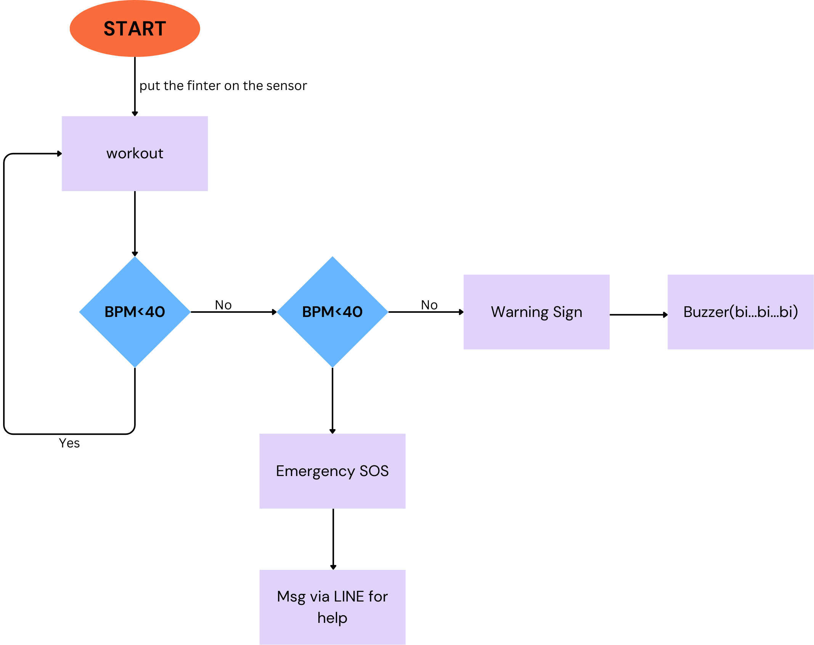

# Group name: Fitness Guys
Repo for demo idea and code for ICT720 course 2025.

## A health-tracking application
This is a health monitoring application that tracks the status of gym trainers in real time. The system utilizes heart rate and motion sensors (IMU) to detect abnormal changes in trainers' physical health during workouts. The application advises trainers on modifying their training or taking a rest. In case of an accident, it functions as an SOS application, sending an SOS signal for help.

## Our members
1. Than Zaw Toe (SIIT,Thammasat)
2. Narodom Yatnimit (KU, Kasetsart University)
3. Luong Duc Nhat (Institute of Science Tokyo)

## User stories
1. As a **gymer**, I want to **know my limitation**, so that **I can stop at the right time**.
  - Acceptance Criteria #1 Enter the age
  - Acceptance Criteria #2 Calculate the average heart rate base on age
2. As a  **gymer**, I want to  **send an SOS signal when I have an accident or need weight support**, so that  **I can receive assistance or get timely help**.
  - Acceptance Criteria #1 Enter the emergency contact
  - Acceptance Criteria #2 Notify your medic.
3. As a **gymer**, I want to **monitor my heart rate and related health precautions while playing weight lifting**
  - Acceptance Criteria #1 I can see the status of my current heart beat
  - Acceptance Criteria #2 I can press the emergency button to call medic.

## Sequence diagram



## Data format
```json
{
    "user": {
        "id": "dvadvfsd12@4egv",
        "name": {
            "last_name": "Luca",
            "first_name": "Luca"
        },
        "occupation": "SIIT",
        "height": 170,
        "age": 26,
        "telephone": 123456789,
        "email": "luca@gmail.com"
    },
    "guarantor": {
        "name": {
            "last_name": "Lucadad",
            "first_name": "Lucadad"
        },
        "relationship": "father",
        "telephone": 123456789,
        "email": "lucadad@gmail.com"
    },
    "weight_logs": [
        { "weight": 70, "timestamp": "2020-01-01 00:00:00" },
        { "weight": 71, "timestamp": "2020-01-02 00:00:00" },
        { "weight": 72, "timestamp": "2020-01-03 00:00:00" }
    ],
    "bmi_logs": [
        { "bmi": 70, "timestamp": "2020-01-01 00:00:00" },
        { "bmi": 71, "timestamp": "2020-01-01 00:00:00" },
        { "bmi": 72, "timestamp": "2020-01-01 00:00:00" }
    ],
    "heart_rate_logs": [
        { "val": 70, "timestamp": "2020-01-01 00:00:00" },
        { "val": 71, "timestamp": "2020-01-01 00:00:00" },
        { "val": 72, "timestamp": "2020-01-01 00:00:00" }
    ]
}

# Project Build and Installation Guide

This document outlines the steps required to build and install the project using Docker Compose. Please follow these instructions carefully to ensure a successful setup.

## Prerequisites

Before proceeding with the installation, ensure you have the following prerequisites installed on your system:

* **Docker:** Ensure Docker is installed and running. You can download and install it from the official Docker website: [https://www.docker.com/get-started](https://www.docker.com/get-started)
* **Docker Compose:** Ensure Docker Compose is installed. Docker Desktop for Windows and macOS includes Docker Compose. If you are using Linux, you may need to install it separately.
* **Git:** Git is necessary for cloning the repository.

## Installation Steps

1.  **Clone the Repository:**

    Use Git to clone the project repository to your local machine.

    ```bash
    git clone <repository_url>
    cd <project_directory>
    ```

    Replace `<repository_url>` with the actual URL of your repository and `<project_directory>` with the directory name.

2.  **Configure Environment Variables:**

    Create a `.env` file by copying the provided `.env-example` file.

    ```bash
    cp .env-example .env
    ```

    Open the `.env` file using a text editor and fill in the required environment variables.

    ```
    PYTHONUNBUFFERED=1  # Recommended for immediate output in logs

    # MongoDB Configuration
    MONGO_DB=<your_mongo_db_name>
    MONGO_COL_DEV=<your_mongo_dev_collection>
    MONGO_COL_USER=<your_mongo_user_collection>
    MONGO_USERNAME=<your_mongo_username>
    MONGO_PASSWORD=<your_mongo_password>
    MONGO_URI=<your_mongo_uri> # Example: mongodb://<user>:<password>@<host>:<port>/<db>

    # REST API Endpoints
    REST_USER_URI=<your_user_api_endpoint>
    REST_ASSET_URI=<your_asset_api_endpoint>
    REST_STATION_URI=<your_station_api_endpoint> #If used

    # MQTT Configuration
    MQTT_BROKER=<your_mqtt_broker_address>
    MQTT_PORT=<your_mqtt_broker_port>
    MQTT_TOPIC=<your_mqtt_topic>

    # LINE Messaging API Configuration
    LINE_CHANNEL_SECRET=<your_line_channel_secret>
    LINE_CHANNEL_ACCESS_TOKEN=<your_line_channel_access_token>
    LINE_USER_ID=<your_line_user_id>
    LIFF_ID=<your_liff_id>
    LINE_URL=<your_line_url>

    # Additional API Configurations
    API_URL=<your_api_url>
    GOOGLE_API_KEY=<your_google_api_key>
    ```

    **Important:** Ensure you replace the placeholder values with your actual configuration details. Securely manage your `.env` file and avoid committing it to version control.

3.  **Build and Run with Docker Compose:**

    Navigate to the project directory containing the `docker-compose.yml` file and execute the following command:

    ```bash
    docker-compose up --build
    ```

    * `docker-compose up`: This command starts the services defined in your `docker-compose.yml` file.
    * `--build`: This option ensures that Docker builds any necessary images before starting the services.

    Docker Compose will build the Docker images and start the containers based on your configuration. You can monitor the logs in your terminal.

4.  **Accessing the Application:**

    Once the containers are running, you can access your application based on the ports and configurations defined in your `docker-compose.yml` file. Check the logs and your docker-compose file for the correct port mappings.

5.  **Stopping the Application:**

    To stop the running containers, use the following command in the same directory:

    ```bash
    docker-compose down
    ```

    This command will stop and remove the containers created by Docker Compose.

## Troubleshooting

* **Image Build Errors:** If you encounter errors during the image build process, carefully review the Dockerfile(s) and ensure all dependencies are correctly specified.
* **Container Startup Issues:** If containers fail to start, check the container logs for error messages. You can view logs using `docker-compose logs <service_name>`.
* **Environment Variable Issues:** Double-check your `.env` file for any typos or incorrect values.
* **Port Conflicts:** Ensure that the ports specified in your `docker-compose.yml` file are not already in use by other applications.
* **Docker Compose Version:** Ensure you have a compatible version of Docker compose installed.

By following these steps, you should be able to successfully build and run your project using Docker Compose.

## How to use the data
1) **Name**
2) **Age**
3) **BMI** ->> four catagories : 
-**Underweight** = < 18.5
-**Normal weight** = 18.5 - 24.9
-**Overweight** = 25-29.9
-**Obesity** = BMI of 30 or greater
	 
4) **Recommended Workout plan**

| BMI Category    | BMI Range       | Workout Focus |
|---------------|-----------------|------------------------------------------------|
| **Underweight** | < 18.5          | Building muscle mass and strength. |
| **Normal Weight** | 18.5 - 24.9   | Maintaining fitness, improving cardiovascular health, and building strength. |
| **Overweight** | 25 - 29.9        | Losing weight, improving cardiovascular health, and building strength. |
| **Obesity** | ≥ 30             | Gradual weight loss, improving cardiovascular health, and increasing mobility. |

