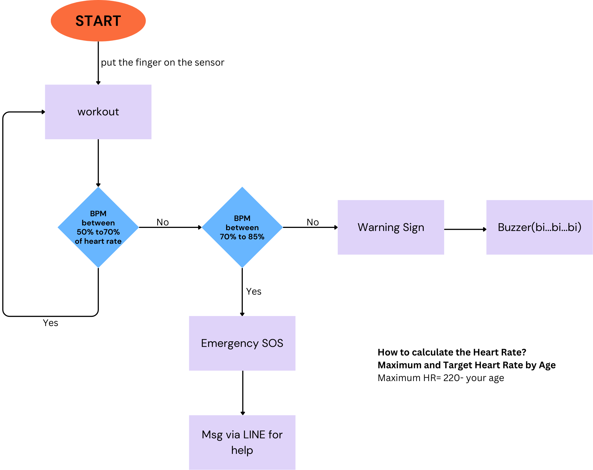

# Group name: Fitness Guys
Repo for demo idea and code for ICT720 course 2025.

## A health-tracking application
This is a health monitoring application that tracks the status of gym trainers in real time. The system utilizes heart rate and motion sensors (IMU) to detect abnormal changes in trainers' physical health during workouts. The application advises trainers on modifying their training or taking a rest. In case of an accident, it functions as an SOS application, sending an SOS signal for help.

## Our members
1. Than Zaw Toe (SIIT,Thammasat)
2. Narodom Yatnimit (KU)
3. Luong Duc Nhat (Institute of Science Tokyo)

## User stories
1. As a **gymer**, I want to **know my limitation**, so that **I can stop at the right time**.
2. As a  **gymer**, I want to  **send an SOS signal when I have an accident or need weight support**, so that  **I can receive assistance or get timely help**.
3. As a **gymer**, I want to **check my heart rate and related health precautions before playing weight lifting**


## Sequence diagram



## Data format
```json
{
    "user": {
        "id": "dvadvfsd12@4egv",
        "name": {
            "last_name": "Luca",
            "first_name": "Luca"
        },
        "occupation": "SIIT",
        "height": 170,
        "age": 26,
        "telephone": 123456789,
        "email": "luca@gmail.com"
    },
    "guarantor": {
        "name": {
            "last_name": "Lucadad",
            "first_name": "Lucadad"
        },
        "occupation": "SIIT",
        "telephone": 123456789,
        "email": "lucadad@gmail.com"
    },
    "weight_logs": [
        { "weight": 70, "timestamp": "2020-01-01 00:00:00" },
        { "weight": 71, "timestamp": "2020-01-02 00:00:00" },
        { "weight": 72, "timestamp": "2020-01-03 00:00:00" }
    ],
    "bmi_logs": [
        { "bmi": 70, "timestamp": "2020-01-01 00:00:00" },
        { "bmi": 71, "timestamp": "2020-01-01 00:00:00" },
        { "bmi": 72, "timestamp": "2020-01-01 00:00:00" }
    ],
    "heart_rate_logs": [
        { "val": 70, "timestamp": "2020-01-01 00:00:00" },
        { "val": 71, "timestamp": "2020-01-01 00:00:00" },
        { "val": 72, "timestamp": "2020-01-01 00:00:00" }
    ]
}
```